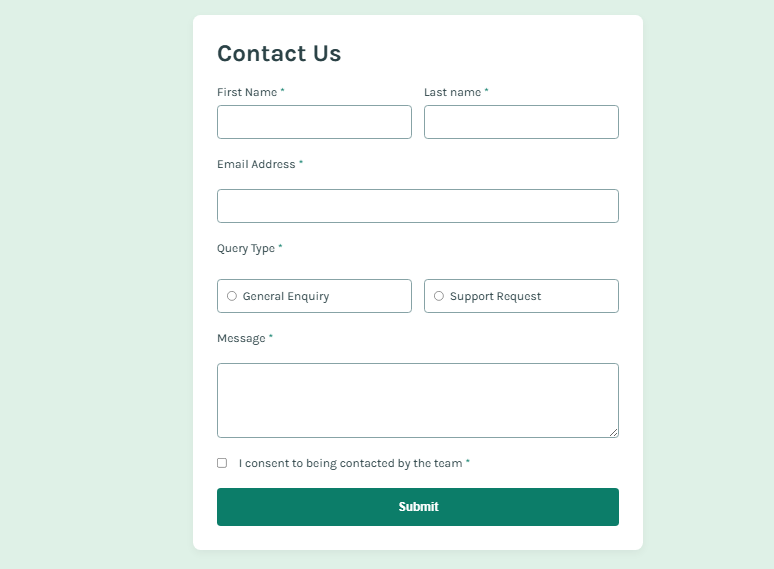

# Frontend Mentor - Contact form solution

This is a solution to the [Contact form challenge on Frontend Mentor](https://www.frontendmentor.io/challenges/contact-form--G-hYlqKJj). Frontend Mentor challenges help you improve your coding skills by building realistic projects.

## Table of contents

- [Overview](#overview)
  - [The challenge](#the-challenge)
  - [Screenshot](#screenshot)
  - [Links](#links)
- [My process](#my-process)
  - [Built with](#built-with)
  - [What I learned](#what-i-learned)
  - [Continued development](#continued-development)
  - [Useful resources](#useful-resources)
- [Author](#author)
- [Acknowledgments](#acknowledgments)

## Overview

### The challenge

Users should be able to:

- Complete the form and see a success toast message upon successful submission  
- Receive form validation messages if:
  - A required field has been missed
  - The email address is not formatted correctly
- Complete the form only using their keyboard
- Have inputs, error messages, and the success message announced on their screen reader
- View the optimal layout for the interface depending on their device's screen size
- See hover and focus states for all interactive elements on the page

### Screenshot

### Links

- Solution URL: *[Add solution URL here]*
- Live Site URL: *[Add live site URL here]*

## My process

### Built with

- Semantic HTML5 markup  
- CSS custom properties  
- Flex-box  
- Mobile-first workflow  
- JavaScript (vanilla)

### What I learned

One new thing I learned from this project is how to change the color of a radio input and a checkbox using CSS.

### Continued development

Not at the moment.

### Useful resources

None used.

## Author

- Name: Abdulhamid Abdullahi Sulaiman  
- Frontend Mentor - [@Yaseeru](https://www.frontendmentor.io/profile/Yaseeru)  
- GitHub - [@Yaseeru](https://github.com/Yaseeru)

## Acknowledgments

I am a solo developer, so nobody was there as usual 😅, but I did get help from ChatGPT. I used AI as a tool to enhance my code but not to do the work for me—it was all my idea.